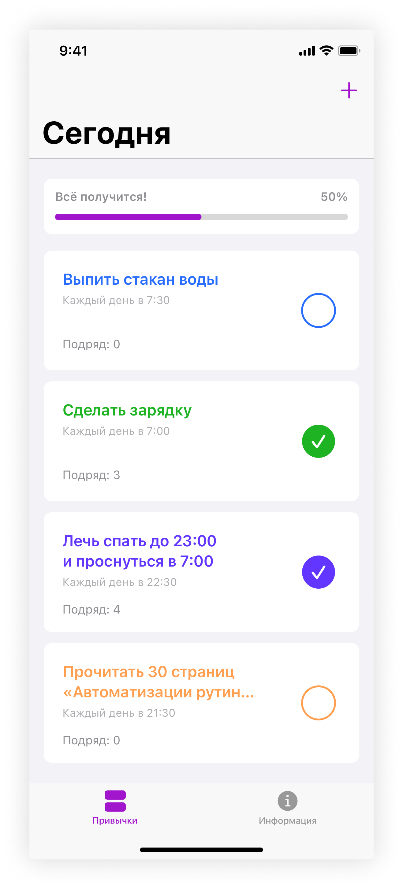
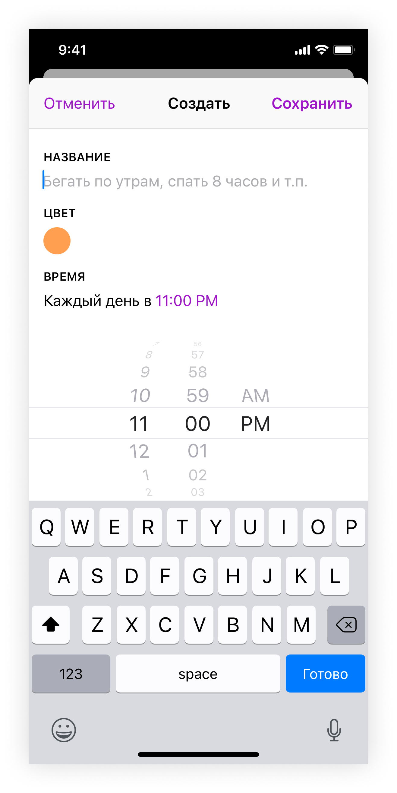
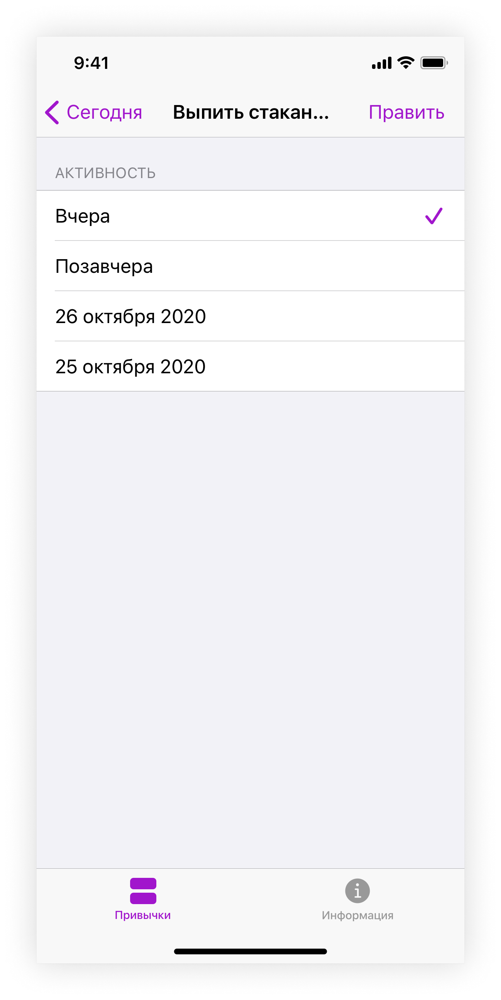

# Мобильное приложение "Трекер полезных привычек"
С помощью приложения "Трекер полезных привычек" пользователи смогут добавлять полезные привычки и следить за прогрессом их выполнения.

## Cписок привычек
   

      
   

   
   ### Добавление новой привычки
   

      
   

   
   ### Показ данных о выбранной привычке
   

      
   

   
   ### Редактирование и удаление добавленной привычки
   

      
   
   
   
## Информация о привычках
   

      
   
